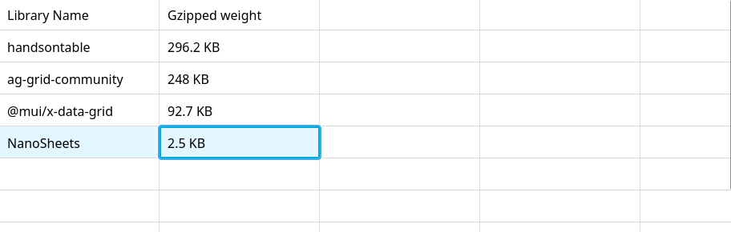

# Nano Sheets

A tiny (2.5kb) javascript spreadsheet UI for modern browsers, with proper virtualization and good performance.
See the demo here : https://nanosheets.lecaro.me/

## Installation

    npm install nanosheets

## Usage

    import {NanoSheets} from "nanosheets"

    const instance = NanoSheets(domNode, {
        data:{'0_0':'Hello world'},
        onChange(data){
            data
        },
        readOnly:false,
    })

## Features :

- copy paste from excel
- infinite grid
- basic editing on mobile (no selection of multiple cells though)
- selection with common mouse and keyboard shortcuts
- virtualized display that can easily display massive datasets
- in-place editing of the data object to use as little ram as possible
- simple data model (a flat hash map of coordinates to string values)
- customise the look of every cell

## How to contribute

- bugfix PRs are welcome
- new features PRs are not welcome
- Issues for bugs are not welcome
- Issues for new features are not welcome

## License

MIT